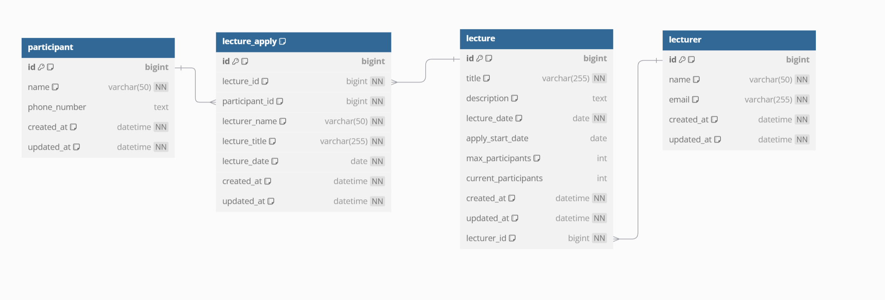

### 요구사항 분석

1. 특강 신청 API
    * 동일한 특강은 한번만 신청 가능하다.
    * 특강은 선착순 30명만 신청 가능하다.
    * 특강은 특강일 1일 전까지만 신청 가능하다.
2. 신청 가능 특강 조회 API
    * 날짜를 입력받아 해당 날짜에 신청 가능한 특강 목록을 조회할 수 있다.
    * 30명이 넘지 않은 특강 목록을 조회할 수 있다.
    * 특강은 특강일 1일 전까지만 신청 가능하다.
3. 특강 신청 완료 목록 조회 API
    * 본인이 신청한 특강 목록을 조회할 수 있다.

### 특강 도메인 테이블 설계 

## 특강 테이블
### 정보
특강에 대한 정보를 담고 있는 테이블입니다. 
### 컬럼
   * 제목
   * 설명
   * 신청 시작일 : 특강 신청 시작일입니다.
   * 특강일 : 특강 진행 날짜입니다.
   * 최대 참가 인원 : 최대 참여 인원입니다.(default:30)
   * 현재 참가 인원 : 특강 신청시 신청 인원을 증가시키는 컬럼입니다.
   * 강사 id : 강사 정보 외래키입니다.
   * 등록일/수정일 : 감사 컬럼입니다. 

## 특강 신청 테이블
### 정보
특강 신청 정보를 담고 있는 테이블입니다.
조회 성능을 최적화하고 신청 시점의 특강 정보 스냅샷을 위해 비정규화를 진행하였습니다.
추후 특강 수정 기능이 추가되면, 아래와 같은 정책 논의가 필요합니다.

ex) 1. 특강일 이후에 특강 정보가 변경되면, 특강 예약 테이블의 정보는 변경되지 않는다.
    2. 특강 테이블 수정은 신청 시작일 이전에만 가능하다.

### 컬럼
  * 특강 id
  * 참가자 id
  * 특강일 : 특강 진행 날짜입니다.
  * 강사 이름 : 강사 이름입니다.
  * 특강 제목 : 특강 제목입니다.
  * 등록일/수정일 : 감사 컬럼입니다.
## 참여자 테이블
### 정보
참여자 정보 테이블입니다.
### 컬럼
  * 이름
  * 전화번호
  * 등록일/수정일 : 감사 컬럼입니다.
  
## 강사 테이블
### 정보
강사 정보 테이블입니다.
### 컬럼
  * 이름
  * 이메일
  * 등록일
  * 수정일
  
### 동시성 제어
* 특강 신청 API
  * 특강 신청은 동일한 특강은 한번만 신청 가능하다.
    * 특강 예약 테이블(lecture_id, participant_id)에 유니크 제약 조건을 걸어 동일한 특강은 한번만 신청 가능하도록 제어한다.
  * 특강은 30명만 신청 가능하다.
    * lecture의 current_participant 컬럼을 두어 특강 신청 시 select for update로 현재 신청 인원 수를 조회하여 30명이 넘으면 신청이 불가능하도록 제어한다.

### Mysql은 어떻게 잠금을 기다리는 트랜잭션의 우선순위를 지정하는가?
Mysql 8 이후 버전은 CATS(Contention-Aware Transaction Scheduling) 알고리즘을 사용하여 잠금을 기다리는 트랜잭션의 우선순위를 지정합니다.
CATS 알고리즘은 가장 많은 트랜잭션을 차단하는 트랜잭션에 더 큰 스케줄링 가중치가 지정됩니다. 가중치가 동일하면 가장 오래 대기하는 트랜잭션에 우선순위가 부여됩니다.

[innodb-transaction-scheduling](https://dev.mysql.com/doc/refman/8.4/en/innodb-transaction-scheduling.html)